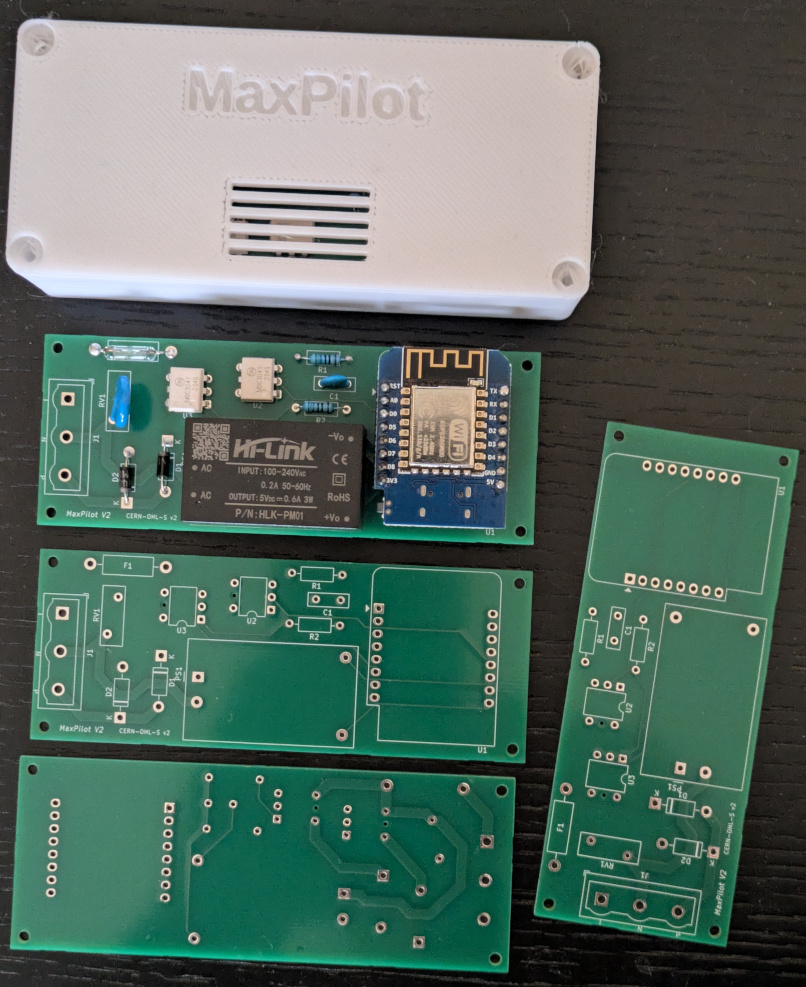
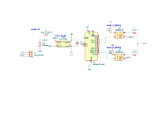
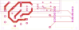
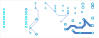

# MaxPilot

[](LICENSE) [](https://esphome.io/) [](https://www.kicad.org/) [](https://www.home-assistant.io/)

> Pilotez vos radiateurs électriques en WiFi depuis Home Assistant — pour moins de 15 €.

[English version → README.en.md](README.en.md)



MaxPilot est une carte open-source qui permet de **contrôler vos radiateurs électriques depuis votre téléphone ou votre ordinateur**, via Home Assistant. Elle se branche sur le fil pilote de vos radiateurs et commande le mode de chauffage (Confort, Éco, Hors-gel, Arrêt) en WiFi. Plus besoin de programmateur mural : vous gérez tout depuis votre domotique. Conçue autour de composants **peu coûteux et facilement disponibles** (WeMos D1 Mini ~3 €, optocoupleurs), elle est accessible à tout amateur d'électronique.

---

## Sommaire

- [C'est quoi le fil pilote ?](#cest-quoi-le-fil-pilote-)
- [Fonctionnalités](#fonctionnalités)
- [Démarrage rapide](#démarrage-rapide)
- [Câblage](#câblage)
- [Schéma](#schéma)
- [Nomenclature](#nomenclature)
- [Configuration ESPHome](#configuration-esphome)
- [Intégration Home Assistant](#intégration-home-assistant)
- [Fabrication du PCB](#fabrication-du-pcb)
- [Boîtier](#boîtier)
- [Sécurité](#sécurité)
- [Licence](#licence)

---

## C'est quoi le fil pilote ?

Le **fil pilote** est un système utilisé en France pour piloter les radiateurs électriques. En plus des fils d'alimentation (phase + neutre), un fil supplémentaire — le fil pilote — transporte un signal de commande 230V AC. Le radiateur adapte son fonctionnement selon la **forme du signal** qu'il reçoit :

| Mode | Ce que fait le radiateur | Signal sur le fil pilote | SSR1 | SSR2 |
|---|---|---|:---:|:---:|
| **Confort** | Chauffe à la température du thermostat | Pas de signal (fil ouvert) | OFF | OFF |
| **Éco** | Réduit la température de ~3-4°C | Sinusoïde complète 230V | ON | ON |
| **Hors-gel** | Maintient ~7°C minimum | Alternance positive uniquement | ON | OFF |
| **Arrêt** | Radiateur éteint | Alternance négative uniquement | OFF | ON |

```
Confort (pas de signal)            Éco (sinusoïde complète)

                                        ╭──╮      ╭──╮
                                       ╱    ╲    ╱    ╲
 ──────────────────────        ───────╱──────╲──╱──────╲───
                                    ╲    ╱    ╲    ╱
                                     ╰──╯      ╰──╯

   SSR1: OFF  SSR2: OFF           SSR1: ON   SSR2: ON


Hors-gel (alternance +)            Arrêt (alternance −)

      ╭──╮      ╭──╮
     ╱    ╲    ╱    ╲
 ───╱──────╲──╱──────╲───     ─────────────────────────────
                                    ╲    ╱    ╲    ╱
                                     ╰──╯      ╰──╯

   SSR1: ON   SSR2: OFF           SSR1: OFF  SSR2: ON
```

MaxPilot utilise **deux optocoupleurs MOC3041M** par canal, avec des **diodes 1N4007**, pour laisser passer sélectivement l'alternance positive, négative, les deux, ou aucune. Les MOC3041M intègrent un détecteur de passage par zéro pour commuter proprement sans parasites.

---

## Fonctionnalités

- Microcontrôleur ESP8266 (WeMos D1 Mini) avec WiFi intégré
- Compatible ESPHome et Home Assistant
- Alimentation AC/DC isolée (HLK-PM01, 5V)
- Protection contre les surtensions (varistance MOV 275V)
- Optocoupleurs à passage par zéro (MOC3041M) pour une commutation propre
- Fusible de protection 1A
- Thermostat intégré avec capteur de température externe (optionnel)
- Boîtier 3D imprimable inclus

---

## Démarrage rapide

1. **Fabriquer ou commander le PCB** — envoyez les fichiers Gerber à un fabricant (JLCPCB, PCBWay...)
2. **Souder les composants** — voir la [nomenclature](#nomenclature) ci-dessous
3. **Flasher le firmware** — branchez le D1 Mini en USB et lancez `esphome run esphome/maxpilot_ch1.yaml`
4. **Câbler la carte** — branchez phase, neutre et fil pilote sur le bornier (voir [câblage](#câblage))
5. **Ajouter à Home Assistant** — le périphérique apparaît automatiquement dans Home Assistant via l'intégration ESPHome
6. **Piloter vos radiateurs** — commandez les modes depuis le tableau de bord ou via des automatisations

---

## Câblage

> ⚠️ **ATTENTION** : Coupez le courant au disjoncteur avant tout câblage !

La carte se branche sur le bornier 3 points (J1). Le fil pilote de votre radiateur est le fil noir (ou parfois gris) présent dans la gaine électrique de votre radiateur.

```
                    Bornier J1 / Terminal block J1
                   ┌─────┬─────┬─────┐
                   │  L  │  N  │  P  │
                   └──┬──┴──┬──┴──┬──┘
                      │     │     │
                      │     │     └──── Fil pilote vers radiateur
                      │     │
                      │     └────────── Neutre (bleu)
                      │
                      └──────────────── Phase (marron ou rouge)

          Depuis le tableau électrique
```

---

## Schéma

Le schéma complet se trouve dans `hardware/kicad/MaxPilot.kicad_sch` (KiCad 9).



### Architecture

```
Secteur AC ──► F1 (fusible 1A) ──► RV1 (varistance) ──► PS1 (HLK-PM01) ──► 5V DC
                                                               │
                                                        U1 (WeMos D1 Mini)
                                                         │            │
                                                     GPIO D3       GPIO D7
                                                         │            │
                                                     R1 (570Ω)    R2 (570Ω)
                                                         │            │
                                                     U2 (MOC3041M) U3 (MOC3041M)
                                                         │            │
                                                     D1 (1N4007)  D2 (1N4007)
                                                         │            │
                                                      Canal 1       Canal 2
```

### Brochage

| GPIO | Fonction |
|------|----------|
| D3   | SSR1 — Optocoupleur U2 (alternance positive) |
| D7   | SSR2 — Optocoupleur U3 (alternance négative) |

---

## Nomenclature

| Réf | Qté | Valeur | Description |
|-----|:---:|--------|-------------|
| F1 | 1 | 1A | Fusible lame mini (Keystone 3568) |
| C1 | 1 | 22µF 25V | Condensateur céramique |
| U1 | 1 | WeMos D1 Mini | Microcontrôleur ESP8266 |
| U2, U3 | 2 | MOC3041M | Optocoupleur triac — couper la pin 5 avant soudure |
| R1, R2 | 2 | 570Ω | Résistances axiales |
| D1, D2 | 2 | 1N4007 | Diodes de protection |
| RV1 | 1 | MOV 275V | Varistance 14D431K (protection surtension) |
| PS1 | 1 | HLK-PM01 | Alimentation AC/DC 5V isolée |
| J1 | 1 | Bornier 3pts 7,62mm | ex : Würth 691311400103, Phoenix MKDS 1,5/3-7,62 |

---

## Configuration ESPHome

### 1. Préparer les secrets

```bash
cp esphome/secrets.yaml.example esphome/secrets.yaml
# Éditez esphome/secrets.yaml avec vos identifiants
```

### 2. Configuration par canal

Voir `esphome/maxpilot_ch1.yaml` pour un exemple de configuration :

```yaml
substitutions:
  name: maxpilot_ch1
  ch_name: "CH1"
  ssr1_pin: D3
  ssr2_pin: D7
  temp_sensor_entity: "none"
  temp_sensor_internal: "true"

packages:
  core: !include common/core.yaml
  wifi: !include common/wifi.yaml
  maxpilot: !include common/maxpilot.yaml

esphome:
  name: ${name}
```

Les fichiers `esphome/common/` contiennent la configuration partagée (WiFi, capteurs, logique fil pilote).

### 3. Capteur de température (optionnel)

Si vous avez un capteur de température dans la pièce, vous pouvez l'importer depuis Home Assistant :

```yaml
substitutions:
  temp_sensor_entity: "sensor.temperature_salon"
  temp_sensor_internal: "false"
```

### 4. Contrôle climatique (optionnel)

Ajoutez le package climate pour un thermostat intégré :

```yaml
packages:
  core: !include common/core.yaml
  wifi: !include common/wifi.yaml
  maxpilot: !include common/maxpilot.yaml
  climate: !include common/maxpilot_climate.yaml
```

| Preset | Consigne | Mode fil pilote |
|--------|:--------:|-----------------|
| **Confort** | 19°C | Confort |
| **Éco** | 17°C | Éco |
| **Hors-gel** | 7°C | Hors-gel |
| **Absent** | — | Arrêt |

### 5. Flasher

```bash
# Premier flash (USB)
esphome run esphome/maxpilot_ch1.yaml

# Mises à jour OTA
esphome run esphome/maxpilot_ch1.yaml --device maxpilot_ch1.local
```

---

## Intégration Home Assistant

Une fois flashé, MaxPilot apparaît automatiquement dans Home Assistant. Vous trouverez :
- **Fil Pilote CH1** — sélecteur de mode : Confort, Éco, Hors-gel, Arrêt
- **Radiateur CH1** *(si climate activé)* — thermostat avec consigne et presets

Exemple d'automatisation :

```yaml
automation:
  - alias: "Radiateur salon - Éco la nuit"
    trigger:
      - platform: time
        at: "22:00:00"
    action:
      - service: select.select_option
        target:
          entity_id: select.fil_pilote_ch1
        data:
          option: "Éco"
```

---

## Fabrication du PCB

Fichiers Gerber prêts pour JLCPCB, PCBWay, etc. — dans `hardware/gerber/`.

| Face avant | Face arrière |
|:--:|:--:|
|  |  |

---

## Boîtier

Un boîtier 3D imprimable est inclus dans `hardware/enclosure/`. Imprimez sans supports en PLA, face ouverte vers le haut.

- **Vis PCB** : 4× M2×6 (fixation sur les plots)
- **Vis couvercle** : 4× M3×13 (auto-taraudant dans les piliers)

---

## Sécurité

> ⚠️ **ATTENTION : Ce projet implique des tensions secteur (230V AC). Risque d'électrocution mortelle.**
> Coupez toujours le courant avant toute intervention. La carte doit être installée dans un boîtier fermé.

Le PCB v2.0 respecte les distances d'isolement IPC-2221B et IEC 62368-1 :
- Clearance mains ↔ basse tension : ≥ 3,0 mm
- Ligne de fuite (*creepage*) : ≥ 5,0 mm

---

## Changelog

### v2.0
- Distances d'isolement conformes IPC-2221B / IEC 62368-1
- Bornier J1 remplacé par pas 7,62 mm
- Empreinte MOC3041M corrigée (pin 5 NPTH)
- Routage mains sur face arrière (B.Cu), sans vias
- Trous de fixation M2 aux 4 coins
- Boîtier 3D imprimable (hardware/enclosure/)

### v1.0
- Premier design fonctionnel

---

## Licence

CERN Open Hardware Licence Version 2 — Strongly Reciprocal (CERN-OHL-S-2.0)

Voir [LICENSE](LICENSE) pour le texte complet.
