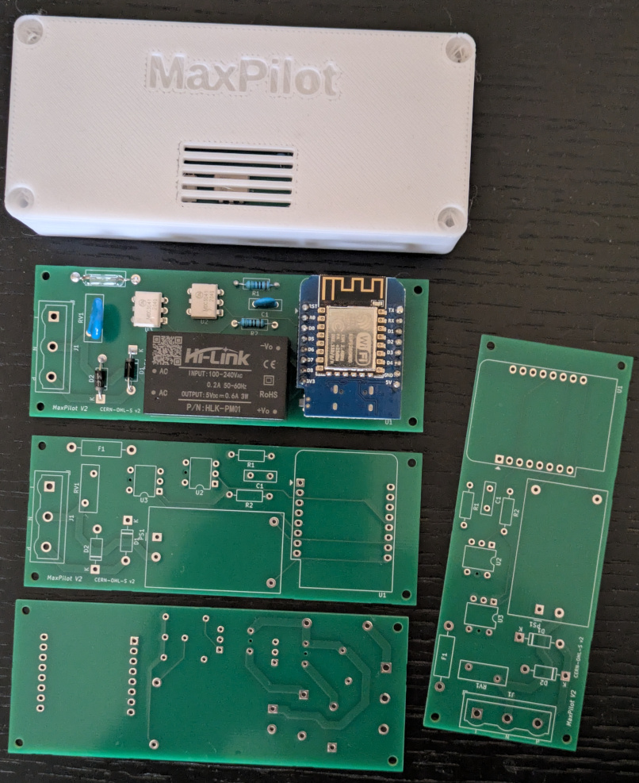
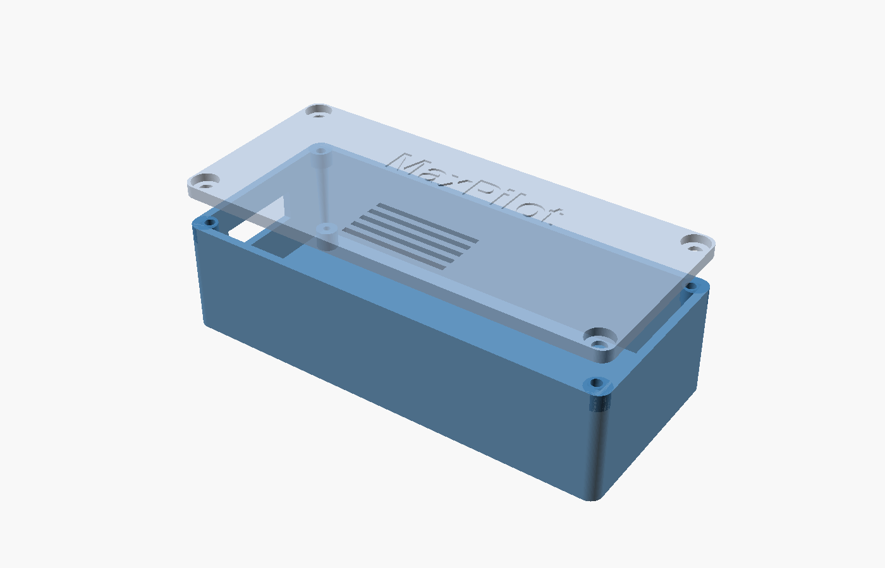
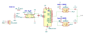
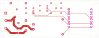

# MaxPilot

[](https://github.com/zefr0g/maxpilot/actions/workflows/validate.yml) [](LICENSE) [](https://esphome.io/) [](https://www.home-assistant.io/) [](https://www.kicad.org/) [](https://github.com/zefr0g/maxpilot/stargazers)

> Pilotez vos radiateurs électriques en WiFi depuis Home Assistant — carte open-source, ~12 € de composants, 100 % local.

[English version → README.en.md](README.en.md)

| Carte assemblée | Boîtier imprimé en 3D |
|:--:|:--:|
|  |  |

MaxPilot est une carte open-source qui se branche sur le **fil pilote** de vos radiateurs électriques et commande leur mode (Confort, Éco, Hors-gel, Arrêt) depuis Home Assistant, via ESPHome. Plus besoin de programmateur mural : la carte remplace le thermostat central, sans cloud ni abonnement. Elle est conçue autour de composants **peu coûteux et faciles à trouver** (WeMos D1 Mini, optocoupleurs, alimentation HLK-PM01) et se soude entièrement en traversant : accessible à tout amateur d'électronique.

## Pourquoi MaxPilot ?

- **Local et ouvert** — pas de cloud, pas d'application propriétaire : ESPHome + Home Assistant, et vous gardez le contrôle
- **Vraiment pas cher** — ~12 € par radiateur, tout compris (voir [le coût](#coût))
- **Un fil pilote, plusieurs radiateurs** — une carte pilote tous les radiateurs raccordés au même fil pilote
- **Thermostat intégré** — importez n'importe quel capteur de température de Home Assistant et laissez la carte réguler
- **Conçu pour le 230 V** — fusible, varistance, alimentation isolée, distances d'isolement IPC-2221B / IEC 62368-1, boîtier fermé
- **Tout est fourni** — schéma et PCB KiCad, Gerbers, nomenclature, firmware, boîtier OpenSCAD/STL

| | MaxPilot | Module WiFi du commerce (ex. Heatzy Pilote) | Module Z-Wave (ex. Qubino Fil Pilote) |
|---|:--:|:--:|:--:|
| Prix indicatif par radiateur | **~12 €** | ~50 € | ~60 € |
| Fonctionne sans cloud | ✅ | ❌ | ✅ |
| Intégration Home Assistant | native (ESPHome) | via intégration tierce | via Z-Wave JS + clé USB |
| Firmware modifiable | ✅ | ❌ | ❌ |
| Matériel ouvert | ✅ | ❌ | ❌ |
| Montage à faire soi-même | oui (soudure traversante) | non | non |

---

## Sommaire

- [C'est quoi le fil pilote ?](#cest-quoi-le-fil-pilote-)
- [Fonctionnalités](#fonctionnalités)
- [Coût](#coût)
- [Démarrage rapide](#démarrage-rapide)
- [Câblage](#câblage)
- [Schéma](#schéma)
- [Nomenclature](#nomenclature)
- [Firmware ESPHome](#firmware-esphome)
- [Intégration Home Assistant](#intégration-home-assistant)
- [Fabrication du PCB](#fabrication-du-pcb)
- [Boîtier](#boîtier)
- [Sécurité](#sécurité)
- [Contribuer](#contribuer)
- [Licence](#licence)

---

## C'est quoi le fil pilote ?

Le **fil pilote** est le système normalisé en France (protocole GIFAM) pour piloter les radiateurs électriques. En plus de la phase et du neutre, un fil supplémentaire — le fil pilote — transporte un signal de commande dérivé du 230 V. Le radiateur choisit son mode selon la **forme du signal** qu'il reçoit :

| Mode | Ce que fait le radiateur | Signal sur le fil pilote | SSR1 | SSR2 |
|---|---|---|:---:|:---:|
| **Confort** | Chauffe à la température du thermostat | Pas de signal (fil ouvert) | OFF | OFF |
| **Éco** | Réduit la consigne de ~3-4 °C | Sinusoïde complète 230 V | ON | ON |
| **Hors-gel** | Maintient ~7 °C minimum | Alternance négative uniquement | ON | OFF |
| **Arrêt** | Radiateur éteint | Alternance positive uniquement | OFF | ON |

```
Confort (pas de signal)            Éco (sinusoïde complète)

                                        ╭──╮      ╭──╮
                                       ╱    ╲    ╱    ╲
 ──────────────────────        ───────╱──────╲──╱──────╲───
                                    ╲    ╱    ╲    ╱
                                     ╰──╯      ╰──╯

   SSR1: OFF  SSR2: OFF           SSR1: ON   SSR2: ON


Hors-gel (alternance −)            Arrêt (alternance +)

                                        ╭──╮      ╭──╮
                                       ╱    ╲    ╱    ╲
 ───────────────────────────       ────╱──────╲──╱──────╲───
    ╲    ╱    ╲    ╱
     ╰──╯      ╰──╯

   SSR1: ON   SSR2: OFF           SSR1: OFF  SSR2: ON
```

MaxPilot utilise **deux optocoupleurs triac MOC3041M** (SSR1 et SSR2), chacun en série avec une **diode 1N4007** montée en sens opposé. SSR1 laisse passer l'alternance négative, SSR2 l'alternance positive ; les deux ensemble donnent la sinusoïde complète. Les MOC3041M commutent au passage par zéro, donc sans parasites. Le fil pilote ne consomme que quelques milliampères : une seule carte peut piloter **tous les radiateurs raccordés au même fil pilote**.

---

## Fonctionnalités

- ESP8266 (WeMos D1 Mini) avec WiFi intégré, firmware ESPHome
- Sélecteur de mode Confort / Éco / Hors-gel / Arrêt dans Home Assistant
- Thermostat optionnel : capteur de température importé depuis Home Assistant, presets Confort / Éco / Hors-gel / Absent
- Mode restauré après coupure de courant
- Alimentation AC/DC isolée (HLK-PM01, 5 V), fusible 1 A, varistance 275 V
- Optocoupleurs à passage par zéro (MOC3041M)
- PCB 99 × 38 mm, composants traversants uniquement, 4 trous de fixation M2
- Boîtier imprimable en 3D (OpenSCAD + STL) avec aération au-dessus de l'alimentation

---

## Coût

Prix indicatifs 2026 (AliExpress / LCSC / grossistes, hors port), pour une carte :

| Composant | Prix approx. |
|---|--:|
| WeMos D1 Mini | 3,00 € |
| HLK-PM01 | 3,00 € |
| 2 × MOC3041M | 1,20 € |
| Bornier 7,62 mm | 0,70 € |
| Porte-fusible + fusible 1 A | 0,80 € |
| Varistance, diodes, résistances, condensateur | 0,60 € |
| PCB (JLCPCB, lot de 5) | ~2,00 € |
| **Total** | **~11 €** |

---

## Démarrage rapide

1. **Commander le PCB** — envoyez `hardware/gerber/MaxPilot.zip` à JLCPCB, PCBWay, Aisler…
2. **Souder les composants** — voir la [nomenclature](#nomenclature) ; tout est traversant
3. **Flasher le firmware** — branchez le D1 Mini en USB et lancez `esphome run esphome/maxpilot_ch1.yaml` (voir [Firmware ESPHome](#firmware-esphome))
4. **Câbler la carte** — phase, neutre et fil pilote sur le bornier, courant coupé (voir [câblage](#câblage))
5. **Fermer le boîtier** — indispensable, la carte est au 230 V
6. **Ajouter à Home Assistant** — le périphérique est détecté automatiquement par l'intégration ESPHome
7. **Piloter vos radiateurs** — depuis le tableau de bord, des automatisations ou le thermostat

---

## Câblage

> ⚠️ **ATTENTION** : coupez le courant au disjoncteur avant tout câblage et vérifiez l'absence de tension.

La carte se branche sur le bornier 3 points (J1). Le fil pilote de votre radiateur est le fil noir (parfois gris) qui sort du radiateur à côté de la phase et du neutre. Il ne doit **jamais** être raccordé au neutre ni à la terre.

```
                    Bornier J1
                   ┌─────┬─────┬─────┐
                   │  L  │  N  │  P  │
                   └──┬──┴──┬──┴──┬──┘
                      │     │     │
                      │     │     └──── Fil pilote vers le(s) radiateur(s)
                      │     │
                      │     └────────── Neutre (bleu)
                      │
                      └──────────────── Phase (marron ou rouge)

          Depuis le tableau électrique (circuit des radiateurs)
```

Alimentez la carte depuis le **même circuit** que les radiateurs qu'elle pilote : le signal fil pilote est référencé au neutre du radiateur.

---

## Schéma

Le schéma complet est dans `hardware/kicad/MaxPilot.kicad_sch` (KiCad 9).



### Architecture

```
Secteur ──► F1 (fusible 1 A) ──► RV1 (varistance) ──► PS1 (HLK-PM01) ──► 5 V
   │                                                          │
   │                                                   U1 (WeMos D1 Mini)
   │                                                    │            │
   │                                                GPIO D3      GPIO D7
   │                                                    │            │
   │                                                R1 (570 Ω)   R2 (570 Ω)
   │                                                    │            │
   ├──────────────────────────────────────────── U2 (MOC3041M)  U3 (MOC3041M)
   │  phase                                            │            │
   │                                               D1 (1N4007)  D2 (1N4007)
   │                                               alternance −  alternance +
   │                                                    └─────┬──────┘
   │                                                          ▼
   └───────────────────────────────────────────────►  P (fil pilote)
```

Les deux optocoupleurs sont branchés en parallèle entre la phase et le fil pilote, chacun à travers sa diode. La partie basse tension (5 V, ESP8266) est isolée du secteur par l'alimentation HLK-PM01 et par les optocoupleurs.

### Brochage

| GPIO | Fonction |
|------|----------|
| D3 (GPIO0)  | SSR1 — U2 + D1, alternance négative (Hors-gel, Éco) |
| D7 (GPIO13) | SSR2 — U3 + D2, alternance positive (Arrêt, Éco) |

Les GPIO commandent la LED des optocoupleurs en logique inversée (niveau bas = allumé). D3 étant une broche de démarrage de l'ESP8266, elle reste haute au boot : le radiateur n'est jamais commuté pendant le démarrage.

---

## Nomenclature

| Réf | Qté | Valeur | Description |
|-----|:---:|--------|-------------|
| U1 | 1 | WeMos D1 Mini | Microcontrôleur ESP8266 |
| PS1 | 1 | HLK-PM01 | Alimentation AC/DC 5 V isolée |
| U2, U3 | 2 | MOC3041M | Optocoupleur triac à passage par zéro, DIP-6 — **couper la broche 5 avant soudure** |
| D1, D2 | 2 | 1N4007 | Diodes de sélection d'alternance |
| R1, R2 | 2 | 560–570 Ω | Résistances axiales (limitation LED des optos) |
| C1 | 1 | 22 µF 25 V | Condensateur céramique de découplage 5 V |
| F1 | 1 | 1 A | Fusible lame mini + porte-fusible Keystone 3568 |
| RV1 | 1 | 14D431K | Varistance 275 V AC |
| J1 | 1 | 3 pts, pas 7,62 mm | Bornier à vis, ex. Würth 691311400103, Phoenix MKDS 1,5/3-7,62 |

La nomenclature exportée de KiCad est dans `hardware/MaxPilot.csv`.

---

## Firmware ESPHome

Le firmware est une configuration ESPHome pure, sans code custom.

```
esphome/
├── maxpilot_ch1.yaml                   # une carte = un fichier (nom, broches, secrets)
├── maxpilot_ch1_with_temp.yaml.example # variante avec thermostat
├── secrets.yaml.example
└── common/
    ├── core.yaml             # carte, API, OTA, WiFi de secours, diagnostics
    ├── maxpilot.yaml         # logique fil pilote (SSR + sélecteur de mode)
    └── maxpilot_climate.yaml # thermostat optionnel
```

### 1. Secrets

```bash
cp esphome/secrets.yaml.example esphome/secrets.yaml
# Éditez esphome/secrets.yaml : WiFi et clé de chiffrement API (openssl rand -base64 32)
```

### 2. Flasher

```bash
# Premier flash (D1 Mini branché en USB)
esphome run esphome/maxpilot_ch1.yaml

# Mises à jour suivantes en OTA
esphome run esphome/maxpilot_ch1.yaml --device maxpilot-ch1.local
```

Pour une deuxième carte, copiez `maxpilot_ch1.yaml` et changez `name` et `ch_name`.

### 3. Thermostat (optionnel)

Si un capteur de température de la pièce existe dans Home Assistant (Zigbee, BLE, autre ESPHome…), la carte peut réguler elle-même. Voir `esphome/maxpilot_ch1_with_temp.yaml.example` :

```yaml
substitutions:
  temp_sensor_entity: "sensor.temperature_salon"   # votre capteur dans Home Assistant

packages:
  core: !include common/core.yaml
  maxpilot: !include common/maxpilot.yaml
  climate: !include common/maxpilot_climate.yaml
```

| Preset | Consigne | Fil pilote |
|--------|:--------:|-----------------|
| **Confort** | 19 °C | Confort quand il fait froid, Éco une fois la consigne atteinte |
| **Éco** | 17 °C | idem, autour de 17 °C |
| **Hors-gel** | 7 °C | idem, autour de 7 °C |
| **Absent** | — | Arrêt |

Le thermostat agit toujours à travers le sélecteur de mode : l'état affiché dans Home Assistant est celui réellement envoyé au radiateur.

### 4. Adoption depuis le tableau de bord ESPHome

La configuration déclare `dashboard_import` : une carte déjà flashée peut être adoptée en un clic depuis le tableau de bord ESPHome (« Adopt »), qui récupère la configuration directement depuis ce dépôt.

---

## Intégration Home Assistant

Une fois flashée, MaxPilot est découverte automatiquement par l'intégration ESPHome. Vous trouverez :

- **Fil Pilote CH1** — sélecteur de mode : Confort, Éco, Hors-gel, Arrêt
- **Radiateur CH1** *(si thermostat activé)* — entité climate avec consigne et presets
- Signal WiFi, uptime et version dans les diagnostics

Exemple d'automatisation :

```yaml
automation:
  - alias: "Radiateurs - Éco la nuit"
    triggers:
      - trigger: time
        at: "22:00:00"
    actions:
      - action: select.select_option
        target:
          entity_id: select.maxpilot_ch1_fil_pilote_ch1
        data:
          option: "Éco"
```

---

## Fabrication du PCB

Fichiers Gerber prêts pour JLCPCB, PCBWay, Aisler… dans `hardware/gerber/` (`MaxPilot.zip` contient tout). PCB 2 couches, 1,6 mm, 99 × 38 mm ; les options par défaut du fabricant conviennent.

| Face avant | Face arrière |
|:--:|:--:|
|  |  |

---

## Boîtier

Un boîtier imprimable en 3D est fourni dans `hardware/enclosure/` (source OpenSCAD + STL). Imprimez en PLA ou PETG, sans supports, face ouverte vers le haut. Le couvercle comporte des fentes d'aération au-dessus de l'alimentation et une découpe pour les fils côté bornier.


- **Vis PCB** : 4 × M2×6 (auto-taraudantes dans les plots)
- **Vis couvercle** : 4 × M3×13 (auto-taraudantes dans les piliers d'angle)

---

## Sécurité

> ⚠️ **ATTENTION : ce projet manipule la tension secteur (230 V AC). Risque d'électrocution mortelle.**
> Coupez toujours le courant avant toute intervention. La carte doit être installée dans un boîtier fermé, hors de portée. Vous êtes responsable de la conformité de votre installation.

Le PCB v2.0 respecte les distances d'isolement IPC-2221B et IEC 62368-1 :
- Clearance secteur ↔ basse tension : ≥ 3,0 mm
- Ligne de fuite (*creepage*) : ≥ 5,0 mm
- Pistes secteur sur la face arrière uniquement, sans via

---

## Contribuer

Photos de montage, retours sur des modèles de radiateurs, corrections et améliorations sont les bienvenus. Voir [CONTRIBUTING.md](CONTRIBUTING.md). Les questions sont ouvertes dans les [Discussions](https://github.com/zefr0g/maxpilot/discussions).

Si ce projet vous est utile, une ⭐ sur le dépôt aide d'autres personnes à le trouver.

---

## Changelog

### v2.1
- Firmware : adoption depuis le tableau de bord ESPHome, thermostat piloté via le sélecteur, secrets uniquement dans le fichier de la carte
- Boîtier v2.4 : piliers de couvercle dans les angles, insertion du PCB sans inclinaison, fentes d'aération
- Documentation : polarité des alternances corrigée (Hors-gel = négative, Arrêt = positive), coût, comparatif
- CI GitHub Actions : validation ESPHome et DRC KiCad

### v2.0
- Distances d'isolement conformes IPC-2221B / IEC 62368-1
- Bornier J1 remplacé par pas 7,62 mm
- Empreinte MOC3041M corrigée (pin 5 NPTH)
- Routage secteur sur face arrière (B.Cu), sans vias
- Trous de fixation M2 aux 4 coins
- Boîtier imprimable en 3D (hardware/enclosure/)

### v1.0
- Premier design fonctionnel

---

## Licence

CERN Open Hardware Licence Version 2 — Strongly Reciprocal (CERN-OHL-S-2.0)

Voir [LICENSE](LICENSE) pour le texte complet.
